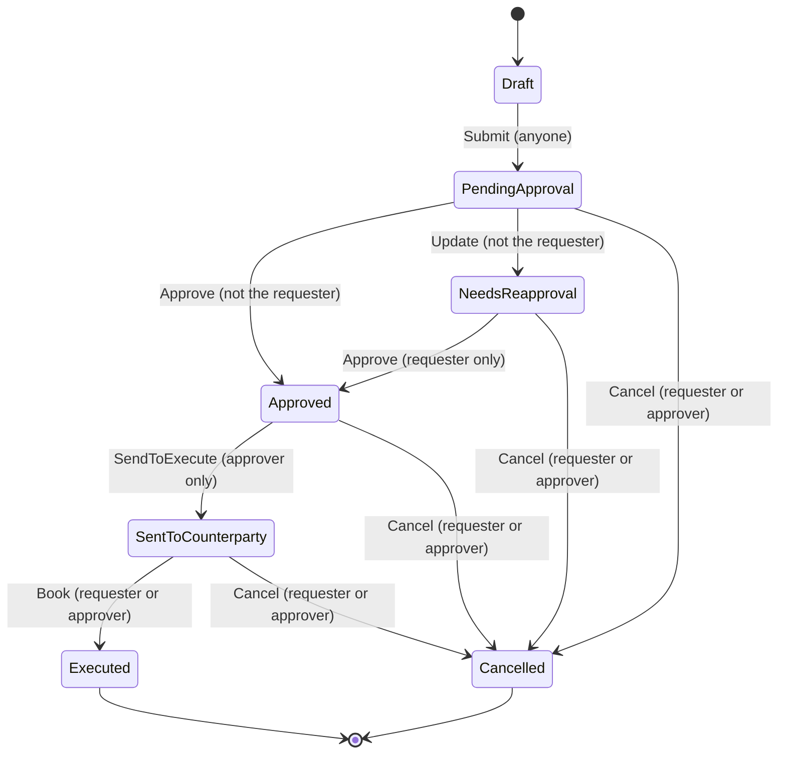

# Trade Approval Case Study

Implementation of the Validus "Implementing a Trade Approval Process" case
study: a Python library (`trade_approval_core`) implementing the trade
lifecycle state machine, plus a thin FastAPI HTTP wrapper
(`trade_approval_api`) with SQLite persistence.

The spec's required deliverable is the **library** — validation rules, state
transitions, authorization, and history/diff APIs, with in-memory storage
acceptable. That is `packages/core`, dependency-free and fully typed. The
HTTP API and durable SQLite storage in `packages/api` are extras built on
top of it, following the spec's encouragement to "think beyond the given
requirements".

This README is written reviewer-first: design decisions, the state machine,
and every assumption made where the spec is ambiguous come before the setup
instructions. If you want to run things immediately, jump to
[Quickstart](#quickstart) or [Setup](#setup).

## Contents

- [Repository layout](#repository-layout)
- [Quickstart](#quickstart)
- [Design & architecture](#design--architecture)
- [The state machine](#the-state-machine)
- [Spec interpretations & assumptions](#spec-interpretations--assumptions)
- [Edge cases & validation](#edge-cases--validation)
- [Core library](#core-library)
- [HTTP API](#http-api)
- [Testing & CI](#testing--ci)
- [Setup](#setup)
- [Running the tests](#running-the-tests)
- [Generative AI usage disclosure](#generative-ai-usage-disclosure)

## Repository layout

Two **independent** projects in one repository:

- **`packages/core`** — the required deliverable: a dependency-free,
  synchronous, event-sourced library implementing the workflow. It is a uv
  workspace project and builds a distributable wheel.
- **`packages/api`** — an extra beyond the brief: a thin FastAPI wrapper
  exposing the workflow over HTTP, backed by SQLite so trades survive a
  restart. It is a **standalone** uv project (deliberately *not* a workspace
  member) that depends on `trade-approval-core` as a **built wheel** — the
  way any external consumer would. It never imports the core source tree.
  The reasoning behind this split is covered in
  [Library-first packaging](#library-first-packaging-the-api-consumes-a-built-wheel).

## Quickstart

Requires [uv](https://docs.astral.sh/uv/) and Python 3.12.

```
uv sync && uv run pytest                 # core library: install + full test suite
(cd packages/core && uv build --out-dir dist)
(cd packages/api && uv sync && uv run pytest)   # API: build core wheel, then test
```

Full instructions, including the wheel rebuild flow and running the server,
are under [Setup](#setup) and [HTTP API](#http-api).

## Design & architecture

### Event-sourced aggregate

A `Trade` is a replayable event log, not a mutable record. Every command
(`submit`, `approve`, `update`, `cancel`, `send_to_execute`, `book`) appends
an immutable event (`Submitted`, `Approved`, `Updated`, ...); every query —
current state, current details, requester, approver — is derived by folding
over that log.

This is not architecture for its own sake: the spec's requirement #4 asks
for trade details *at any previous state*, a *tabular history of actions*
with users, timestamps, and state transitions, and *differences between two
versions*. With an event log these are queries, not features:

- `details_as_of(seq)` folds the log up to `seq`;
- `history()` walks the log emitting one `ActionRecord` per event, with
  `state_before`/`state_after` recomputed from the transition map;
- `diff(seq_a, seq_b)` compares two folds field-by-field.

A mutable-record design would need a separate, bolt-on audit table kept in
sync with the record; here the audit trail *is* the source of truth, so it
cannot drift.

Events are frozen dataclasses; an `Updated` event stores only the changed
fields (frozen via `MappingProxyType`), computed by the aggregate itself.
`Trade.from_events(trade_id, events)` rehydrates a trade from persisted
events — this is the entire persistence SPI.

### State machine as data, transitions as authorization

The whole workflow is two module-level tables in
`packages/core/src/trade_approval_core/trade.py`:

- `ALLOWED_TRANSITIONS: dict[(State, Action), Transition]` — which actions
  are legal from which states, and who may take them;
- `ACTION_TO_STATE_MAP: dict[event type, State]` — the state an event leaves
  the trade in.

Every command does the same three steps: look up the `(current_state,
action)` pair (miss → `InvalidTransitionError`), ask the transition's
authorization strategy to `authorize(trade, user)` (refusal →
`UnauthorizedActionError`), then append the event. The `Transition`
subclasses in `transition.py` (`Unrestricted`, `NotRequester`,
`RequesterOnly`, `ApproverOnly`, `RequesterOrApprover`) carry *only*
authorization logic — deliberately no target state, so the state mapping has
a single source of truth and the two tables cannot disagree.

Adding or tightening a rule is a one-line table edit, and the table doubles
as documentation — the [transition table](#the-state-machine) below is a
direct transcription of it.

### Authorization from history, identity as trusted input

The spec names roles ("Requester", "Approver") but defines no user model —
a user is a bare ID string. The library therefore authorizes purely against
the trade's own event history:

- the **requester** is the author of the first event (the submission);
- the **approver** is the author of the first `Approved` **or** `Updated`
  event (see [interpretation #2](#2-who-is-the-approver)).

`UserId` is *trusted* input: authenticating that the caller really is that
user is the caller's responsibility (the HTTP layer stands in an
`X-User-Id` header for a real authenticated identity). There is no user
directory or role system anywhere in core — the strongest enforceable
properties without one are four-eyes rules over the trade's own
participants, and those are exactly what the library enforces.

One detail worth noting: `UnauthorizedActionError` messages name the rule
that was violated ("must be the original requester"), never the permitted
user IDs — an unauthorized caller does not learn who the trade's
participants are.

### Persistence as a port

Core defines `TradeStore` as a `Protocol` (`store.py`) — `save`, `get`,
`list(*, limit, after)` — with a documented contract: persistence is
append-only (events are immutable history), and a store facing genuine
concurrent writers must raise `ConcurrentModificationError` rather than ever
silently overwriting. `InMemoryTradeStore` is the in-process default,
satisfying the spec's "data can be stored in memory".

The durable adapter lives in the *consumer*: the API package implements
`SqliteTradeStore` against this Protocol using only core's public API — one
`events` table keyed by `(trade_id, seq)`, `save()` appending only new
events, `get()` replaying rows through `Trade.from_events`. The primary key
makes the concurrency contract structural: a lost-update race surfaces as an
`IntegrityError` mapped to `ConcurrentModificationError` (HTTP 409), never
as corrupted history.

### Error hierarchy

Every domain rejection derives from `TradeError` (`errors.py`), but the
hierarchy is deliberately shaped so that broad catches stay honest:

- `ValidationError(TradeError)` is the sub-base for *value* problems only —
  date ordering, notional/strike bounds, party names, currency consistency,
  no-op updates, event-shape checks.
- The non-value rejections — `InvalidTransitionError`,
  `UnauthorizedActionError`, `ConcurrentModificationError`,
  `InvalidSeqError`, `CorruptEventLogError`, `MissingTradeDetailsError` —
  are **siblings** of `ValidationError`, so catching `ValidationError` can
  never swallow a state conflict or a permissions failure.
- `TradeNotFoundError` sits *outside* the hierarchy entirely: a lookup miss
  is not a domain rejection, and code catching `TradeError` to mean "the
  domain refused this" should not absorb a missing trade by accident.

Each concrete error carries the offending values as attributes
(`strike_rate`, `underlying`, ...), so callers can react programmatically
rather than parsing messages. The HTTP layer maps this tree onto status
codes with an eight-line table (see [HTTP API](#http-api)).

Non-obvious detail: finiteness is checked *before* sign for `Decimal`
amounts, because comparing a NaN `Decimal` raises
`decimal.InvalidOperation` — an error that would otherwise escape the
domain hierarchy entirely.

### Library-first packaging: the API consumes a built wheel

`packages/api` depends on `trade-approval-core` as a **built wheel**
(`[tool.uv.sources]` points at `../core/dist/*.whl`) instead of being a uv
workspace member importing the core source tree.

This is intentional emphasis, not an accident: the spec's required
deliverable is the *library*, and the API is an extra consumer of it.
Pinning the API to the built artifact proves the boundary — core is an
independent, distributable package with a complete public surface, and the
API gets no private access the way any external consumer wouldn't. If
core's public API were insufficient, the API package would fail to build
rather than quietly reaching into internals.

The accepted costs:

- Every core change requires rebuilding the wheel and re-pinning
  (`uv build --out-dir dist` in `packages/core` — plain `uv build` outputs
  to the workspace root `dist/`, leaving the API pinned to a stale wheel —
  then `uv lock --refresh-package trade-approval-core` in `packages/api`;
  see [Setup](#setup)).
- A core version bump means editing the wheel path in
  `packages/api/pyproject.toml`.
- CI's `uv lock --check` hash pin works because hatchling builds are
  byte-reproducible; a non-deterministic build step in core would break it.

On a real team, a workspace/path dependency (or a private package index) is
the pragmatic choice for day-to-day velocity; the wheel pin exists here to
make the library-first architecture explicit.

## The state machine



The full transition table — a direct transcription of `ALLOWED_TRANSITIONS`
and `ACTION_TO_STATE_MAP` in `packages/core/src/trade_approval_core/trade.py`:

| From | Action | Who may act | To |
|---|---|---|---|
| Draft | Submit | anyone | PendingApproval |
| PendingApproval | Approve | anyone **except** the requester (four-eyes) | Approved |
| PendingApproval | Update | anyone **except** the requester (four-eyes) | NeedsReapproval |
| PendingApproval | Cancel | requester or recorded approver¹ | Cancelled |
| NeedsReapproval | Approve | the original requester only | Approved |
| NeedsReapproval | Cancel | requester or recorded approver | Cancelled |
| Approved | Cancel | requester or recorded approver | Cancelled |
| Approved | SendToExecute | the recorded approver only | SentToCounterparty |
| SentToCounterparty | Book | requester or recorded approver | Executed |
| SentToCounterparty | Cancel | requester or recorded approver | Cancelled |

¹ From `PendingApproval` no approver exists yet, so in practice only the
requester may cancel there — see
[interpretation #3](#3-four-eyes-as-the-stand-in-for-the-approver-input).

`Executed` and `Cancelled` are terminal: no action is allowed from either.
Any `(state, action)` pair not in the table raises
`InvalidTransitionError` (HTTP 409); a pair that *is* in the table but with
the wrong user raises `UnauthorizedActionError` (HTTP 403). The "approver"
column refers to the approver *recorded in the trade's history* — the author
of the first `Approved` or `Updated` event.

## Spec interpretations & assumptions

Places where the case-study spec is ambiguous, self-contradictory, or
silent, and the reading the core library commits to. None of these are
deviations for convenience — each is the interpretation that keeps the
spec's own tables and example scenarios mutually consistent. File references
point at `packages/core/src/trade_approval_core/`.

### 1. `Update` from `PendingApproval`: the spec contradicts itself

The State Transitions table (p.3) lists PendingApproval's allowed next
actions as "Accept, Cancel" — no Update. But Example Scenario 2 (p.4)
performs `Update` from `PendingApproval` (step 2: User2 updates, state goes
`PendingApproval -> NeedsReapproval`), and the Actions table (p.3) defines
Update as a supported action.

**Reading taken**: follow the scenario. `(PendingApproval, Update)` is an
allowed transition (`trade.py`, `ALLOWED_TRANSITIONS`). This is the only
reading under which Update is reachable at all — taking the table literally
would make the Update action, the `NeedsReapproval` state, and Scenario 2
all dead spec text.

Update is *not* allowed from any other state (including `NeedsReapproval`),
exactly as the table says.

### 2. Who is "the approver"

The spec names an "Approver" as the required actor for Accept/Approve,
Update, and SendToExecute, but defines no role system — there is no user
directory, and any User ID is just a string. The library derives the
approver from the trade's own history: `Trade.approver` (`trade.py`) is the
author of the first `Approved` **or** `Updated` event.

Including `Updated` follows the spec's own wording — NeedsReapproval is
described as "the trade details were updated **by the approver**" (p.3), so
the updater holds the approver role from that point on.

Consequence, visible in the Scenario 2 path (Submit User1 → Update User2 →
Reapprove User1): the approver is User2, so `SendToExecute` (approver-only)
is available to User2 and **not** to User1, even though User1's reapproval
is what produced the `Approved` state. That is deliberate: User1 is the
requester approving *their counterparty's* amendment; the reviewing role
never transfers to them. An alternative reading — "approver = whoever last
approved" — would let the requester both reapprove and dispatch their own
trade with no second party involved at execution time.

### 3. Four-eyes as the stand-in for the "Approver" input

For actions taken *before* any approver identity exists — `Approve` and
`Update` from `PendingApproval` — the spec's "User ID (Approver)" input
cannot be checked against a role. The library substitutes a four-eyes rule
(`NotRequester`, `transition.py`): anyone **except the requester**, who
authored the pending submission, may act.

This means any third user can approve or amend a pending submission — the
guarantee enforced is "no one self-approves", not "only designated approvers
approve". With no user model in the spec, the latter is unenforceable;
four-eyes is the strongest property available and the one that matters for
an approval workflow.

Reapproval is stricter and *is* taken verbatim from the spec:
`(NeedsReapproval, Approve)` is requester-only (`RequesterOnly`), per
"requiring reapproval from the original requester" (p.3). The updater cannot
approve their own amendment, and an unrelated third party is rejected too.

`Cancel` takes the opposite reading of the same word: its "Requester or
Approver" input (p.3) is checked against the *recorded* approver
(`RequesterOrApprover`, `transition.py`), so from `PendingApproval` — where
no `Approved`/`Updated` event exists yet — only the requester may cancel.

The two readings do not compose into a hard boundary: a non-requester who is
refused a direct cancel can update any field (becoming the recorded
approver, per item 2) and then cancel from `NeedsReapproval` — two calls, at
the cost of a junk `Updated` event in the audit history. This is accepted
as-is: that same user already holds the strictly stronger powers of
approving the trade or amending its details, so the pre-approval cancel
restriction is the literal spec reading, not a security guarantee. The
uniform alternative — reading Cancel's "Approver" prospectively as well —
would make pre-approval Cancel unrestricted (requester plus
everyone-but-the-requester is everyone), a larger departure from the spec
text. A real boundary would need designated approvers, which the spec's
user model (bare User IDs) does not provide.

### 4. Draft: a real state, not a stored phase

The spec describes Draft as "the trade has been created but not submitted"
(p.3), which could suggest a persistable draft carrying editable details.
The library instead models Draft as the state of a `Trade` with an empty
event log: `Trade()` is creation, `submit()` is the first event, and details
attach at submit — exactly matching the Actions table, where Submit's inputs
are "User ID, trade details" (p.3).

Nothing observable is lost:

- Draft is a real, reportable state — `Trade.state` returns `Draft` before
  submission, and every history row for a first action shows
  `Draft -> PendingApproval`, matching all four example scenario tables.
- Draft's only allowed action is Submit, per the table; the other five
  actions are rejected from Draft.
- A "draft with saved details" model would need edit/save actions in Draft,
  which the spec does not define — there is no action that could populate or
  change details before Submit.

The one behavioural consequence: a Draft trade has no details and no
requester (`None` until submit). Since the spec gives Draft no
detail-bearing inputs and no actions besides Submit, no spec-visible
behaviour depends on them.

### 5. `Book` takes the strike rate, beyond the spec's listed inputs

The Actions table (p.3) lists Book's inputs as "User ID (Requester or
Approver), confirmation of execution" — no strike. But the Strike field is
defined as "agreed rate. This information is only available after trades are
executed" (p.3), and the spec provides no other action that could record it.

**Reading taken**: `Book` is the point where execution results enter the
system, so `Trade.book()` (`trade.py`) takes `strike_rate` alongside the
confirmation, and the `Booked` event folds it into the trade details.
Booking is terminal (`Executed` allows no further actions), so this is the
only opportunity to capture the rate; omitting it would make the Strike
field unrecordable dead spec text, the same trap as reading the transitions
table literally in item 1.

Symmetrically, the strike is rejected as *input* anywhere else: `submit` and
`update` refuse details carrying a strike rate
(`Trade._reject_premature_strike`), enforcing "only available after trades
are executed" in both directions — it cannot be supplied early, and it
cannot be lost at the end.

### 6. Underlying: an ordered pair of two distinct currencies

The spec defines Underlying as "a combination of eligible notional
currencies" (p.3) without fixing how many or whether order matters. The
library commits to an ordered pair — `tuple[Currency, Currency]`
(`trade_details.py`) — with two consequences:

- **Exactly two, distinct.** The system standardises forward contracts
  (Style "assumes the trade is a forward contract", p.3), and an FX forward
  exchanges exactly two currencies. A same-currency pair — effectively a
  combination of one — is rejected (`DuplicateUnderlyingCurrencyError`):
  it has no meaningful exchange rate.
- **Order is significant.** `(USD, EUR)` and `(EUR, USD)` are different
  underlyings, following FX base/quote convention where direction of the
  pair carries meaning. An update that only swaps the order therefore counts
  as a real change and triggers reapproval. An unordered-set reading would
  also satisfy the spec text; the ordered reading is the stricter one and
  loses no information.

The notional currency must be one of the two, verbatim from "the notional
currency selected must be part of the underlying" (p.3).

### 7. "Eligible notional currencies": national currencies only

The Notional Currency field points at the IBAN Currency Codes list (p.3),
which is the ISO 4217 register presented country-by-country. The `Currency`
enum (`enums.py`) vendors the active ISO 4217 codes but excludes codes that
are not money a trade could be denominated in: the standard's own reserved
codes (XTS, XXX), funds codes (BOV, CHE, CHW, CLF, COU, MXV, USN, UYI,
UYW), precious metals (XAU, XAG, XPD, XPT), bond-market units (XBA–XBD),
and supranational accounting units (XAD, XDR, XSU, XUA). Supranational
codes that *are* circulating money (XOF, XAF, XCD, XCG, XPF) stay. The enum
docstring records the vendoring source and snapshot date.

### 8. Diff shape: snake_case field names, raw values

The Differences API example (p.5) shows
`{"notionalAmount": ("1,000,000", "1,200,000")}` — a camelCase key and
display-formatted strings. The library returns
`{"notional_amount": (Decimal("1000000"), Decimal("1200000"))}`
(`trade.py`, `Trade.diff`).

**Reading taken**: the example is illustrative ("e.g."), not a wire format.
Diff keys are the `TradeDetails` field names verbatim, so callers can match
them against detail attributes directly; values are the raw field values
(`Decimal`s, dates, enums) so callers can compute with them. Display
formatting such as thousands separators is presentation, left to consumers.
The HTTP layer preserves the same shape — snake_case keys, `Decimal`s
encoded as JSON strings (see the API [conventions](#conventions)) — so the
two surfaces never disagree.

Two consequences, both deliberate:

- `diff(seq_a, seq_b)` is oriented: each value is
  `(value at seq_a, value at seq_b)`, and a reversed range swaps the pairs
  rather than raising.
- Because the strike rate folds into the details at `Book` (item 5), a diff
  spanning the `Booked` event reports `strike_rate` going from `None` to the
  executed rate.

## Edge cases & validation

Behaviour at the boundaries, all covered by tests (see
[Testing & CI](#testing--ci)).

**`TradeDetails` is self-validating** — it cannot be constructed in an
invalid state. Checks run in a fixed order and the first failure wins, each
raising a dedicated `ValidationError` subclass
(`trade_details.py`):

1. `trading_entity` and `counterparty` must be non-blank
   (`EmptyPartyNameError`);
2. `trade_date <= value_date <= delivery_date` — the spec's validation rule;
   equal dates are valid (`InvalidDateOrderError`);
3. the notional amount must be finite — checked *before* the sign, since
   comparing a NaN `Decimal` would raise outside the domain hierarchy
   (`NonFiniteNotionalAmountError`);
4. the notional amount must be strictly positive
   (`NonPositiveNotionalAmountError`);
5. the underlying currencies must be distinct
   (`DuplicateUnderlyingCurrencyError`);
6. the notional currency must be one of the underlying pair
   (`NotionalCurrencyMismatchError`);
7. a strike rate, if present, must be finite and positive
   (`NonFiniteStrikeRateError`, `NonPositiveStrikeRateError`).

**Updates**:

- An update whose details equal the current ones is rejected
  (`NoOpUpdateError`) — it would force a reapproval round while changing
  nothing. Equality is `Decimal` equality, so `1000000` vs `1000000.00` is
  still a no-op.
- `Updated` events store only the changed fields, computed by the aggregate;
  an `Updated` event with no changes is itself invalid
  (`EmptyChangesError`).

**Strike & confirmation**:

- A strike rate supplied at submit or update time is rejected
  (`StrikeBeforeExecutionError`) — per the spec it exists only after
  execution, so `Book` is its single entry point, and it is absent
  (`None`) until then.
- The booking confirmation must be non-empty (`EmptyConfirmationError`).
  It is execution metadata carried by the `Booked` event, not a trade
  detail — surfaced as `Trade.confirmation`, `None` before booking.

**History, versions, and diffs**:

- `details_as_of(seq)` / `diff` reject a seq with no matching event —
  negative or past the last event (`InvalidSeqError`, HTTP 404).
- A reversed diff range is not an error: the pairs swap orientation.
- A trade's `latest_seq` (HTTP responses) always addresses its current
  version, so clients can diff against "now" without reading the history
  first.

**Concurrency**: two copies of the same trade loaded, both modified, both
saved — the second `save()` raises `ConcurrentModificationError` (HTTP
409). The SQLite store enforces this structurally via the `(trade_id, seq)`
primary key: the race loses at the database, never by silent overwrite.
Re-saving the *same* trade object after a conflict is not itself a conflict.

**Events**: event `seq` must be non-negative (`NegativeEventSeqError`) and
timestamps must be timezone-aware (`NaiveEventTimestampError`) — persisted
history is unambiguous about ordering and time.

## Core library

`trade_approval_core` implements the state machine described
[above](#the-state-machine). Public entry points are re-exported from the
package root, so `from trade_approval_core import ...` is the intended way
to use the library. Every name below also stays importable from its
defining submodule (e.g. `trade_approval_core.trade.Trade`); the test suite
uses that route for a few internal-only details (the transition table, the
authorization strategies) that are deliberately not part of the public
surface:

- **Aggregate**: `Trade` — the aggregate root. Commands: `submit`,
  `approve`, `update`, `cancel`, `send_to_execute`, `book`.
  Queries: `history()`, `details_as_of(seq)`, `diff(seq_a, seq_b)`, and the
  `state`/`requester`/`approver`/`confirmation` properties.
  `TradeDetails` — the self-validating trade details dataclass, the main
  input to `submit`/`update`.
- **Identifiers**: `UserId`, `TradeId`.
- **Enums**: `Currency`, `State`, `Action`, `Direction`, `Style`.
- **History**: `ActionRecord` — one row of `Trade.history()`'s return value.
- **Events**: `Event` and its concrete records (`Submitted`, `Approved`,
  `Updated`, `Cancelled`, `SentToExecute`, `Booked`) — the persistence SPI:
  what `Trade.events` exposes, what a store persists, and what
  `Trade.from_events` replays.
- **Persistence**: `TradeStore` — the persistence *port* (a Protocol), with
  `InMemoryTradeStore` as the default in-process implementation. Durable
  adapters live in the consumer: the API provides a SQLite-backed
  `SqliteTradeStore` implementing this Protocol from core's public API alone.
- **Errors**: the typed exception hierarchy described under
  [Design & architecture](#error-hierarchy).

Example (the full case-study scenarios are exercised in
`packages/core/tests/test_scenarios.py`):

```python
from datetime import date
from decimal import Decimal

from trade_approval_core import Currency, Direction, Trade, TradeDetails, UserId

details = TradeDetails(
    trading_entity="Acme Corp",
    counterparty="Beta Bank",
    direction=Direction.BUY,
    notional_currency=Currency.USD,
    notional_amount=Decimal("1000000"),
    underlying=(Currency.USD, Currency.EUR),
    trade_date=date(2026, 1, 1),
    value_date=date(2026, 1, 2),
    delivery_date=date(2026, 1, 3),
)

trade = Trade()
trade.submit(UserId("user-1"), details)
trade.approve(UserId("user-2"))  # four-eyes: a different user must approve
```

## HTTP API

`trade_approval_api` is a thin wrapper: every workflow rule lives in
`trade_approval_core` (installed as a built wheel), and this layer only
handles HTTP concerns — request/response schemas and mapping core exceptions
to status codes. Trades are persisted through `SqliteTradeStore` rather than
kept only in memory.

### Run it

From `packages/api` (after the [Setup](#setup) step that builds the core
wheel and syncs the API):

```
cd packages/api
uv run uvicorn trade_approval_api.main:app --reload
```

Interactive docs: http://127.0.0.1:8000/docs (OpenAPI schema at `/openapi.json`).

By default trades are stored in `./trades.db`. Override with:

```
TRADE_APPROVAL_DATABASE_PATH=/path/to/trades.db uv run uvicorn trade_approval_api.main:app
```

### Conventions

- **Acting user**: every mutating endpoint requires an `X-User-Id` header —
  there is no authentication in this prototype, the header stands in for an
  authenticated identity. A missing header returns `401`.
- **JSON shape**: field names are snake_case, matching the core dataclasses
  directly. `Decimal` fields (`notional_amount`, `strike_rate`) are encoded
  as JSON strings (pydantic v2's default), avoiding float precision loss.
- **Trade version**: every trade response carries `latest_seq`, the seq of
  its most recent event. Pass it straight to `/details/{seq}` or `/diff` to
  address the current version without first reading `/history`.
- **Pagination**: `GET /trades` returns `{"items": [...], "next_cursor":
  <trade id | null>}` in trade-id order, `limit` per page (default 50, max
  200). Pass `next_cursor` as `after` to fetch the following page; `null`
  means the last page.
- **Confirmation**: once a trade is booked, its response includes the
  counterparty `confirmation` reference (`null` until then). It is execution
  metadata carried by the Book action, not a trade detail, so it sits at the
  top level of the trade rather than inside `details`.
- **Errors**: failures return `{"detail": "<message or list of field errors>"}`.

  | Situation | Status |
  |---|---|
  | Domain validation failure (bad date order, non-positive notional, no-op update, empty confirmation, ...) | 422 |
  | Malformed request body (missing/extra/mistyped field) | 422 (FastAPI's own, list-shaped `detail`) |
  | Action not valid from the trade's current state | 409 |
  | Two writers modified the same trade concurrently | 409 |
  | User not permitted to take this action (four-eyes, wrong approver, ...) | 403 |
  | Missing `X-User-Id` header | 401 |
  | Trade, or a referenced historical version, not found | 404 |

  Internal errors (a corrupt event log, details accessed before submission)
  return `500` with a generic detail and a logged traceback — internals are
  never leaked to the client.

### Endpoints

| Method | Path | Body | Notes |
|---|---|---|---|
| POST | `/trades` | trade details | Submit; `201` + `Location` header |
| GET | `/trades?limit={n}&after={id}` | — | List trades (cursor-paginated) |
| GET | `/trades/{trade_id}` | — | Get one trade |
| POST | `/trades/{trade_id}/approve` | — | Four-eyes / requester-only enforced |
| POST | `/trades/{trade_id}/update` | trade details | Full replacement; moves to `NeedsReapproval` |
| POST | `/trades/{trade_id}/cancel` | — | Requester or approver |
| POST | `/trades/{trade_id}/send-to-execute` | — | Approver only |
| POST | `/trades/{trade_id}/book` | `strike_rate`, `confirmation` | Records execution |
| GET | `/trades/{trade_id}/history` | — | Tabular action history (user, timestamp, state before/after) |
| GET | `/trades/{trade_id}/details/{seq}` | — | Trade details as of a previous event |
| GET | `/trades/{trade_id}/diff?from={a}&to={b}` | — | Field-level diff between two versions |
| GET | `/health` | — | Liveness check |

### Walkthrough: Example Scenario 3 (execution)

```
BASE=http://127.0.0.1:8000

# Submit
ID=$(curl -s -X POST $BASE/trades \
  -H "X-User-Id: user-1" -H "Content-Type: application/json" \
  -d '{
    "trading_entity": "Acme Corp", "counterparty": "Beta Bank",
    "direction": "Buy", "notional_currency": "USD",
    "notional_amount": "1000000", "underlying": ["USD", "EUR"],
    "trade_date": "2026-01-01", "value_date": "2026-01-02", "delivery_date": "2026-01-03"
  }' | jq -r .id)

# Approve (must be a different user -- four-eyes)
curl -s -X POST $BASE/trades/$ID/approve -H "X-User-Id: user-2"

# Send to counterparty (approver only)
curl -s -X POST $BASE/trades/$ID/send-to-execute -H "X-User-Id: user-2"

# Book once executed
curl -s -X POST $BASE/trades/$ID/book \
  -H "X-User-Id: user-1" -H "Content-Type: application/json" \
  -d '{"strike_rate": "1.2345", "confirmation": "CONF-1"}'

# Inspect history and a diff
curl -s $BASE/trades/$ID/history | jq
curl -s "$BASE/trades/$ID/diff?from=0&to=1" | jq
```

### Known trade-off: synchronous SQLite on the event loop

Every route handler is `async def` but performs blocking SQLite I/O directly
on the event loop (`SqliteTradeStore` uses the stdlib `sqlite3` module with
a single connection). Requests therefore serialize: while one request is
doing disk I/O, no other request makes progress — including `/health`. A
slow disk stalls the whole server.

This is the documented intent (see the `SqliteTradeStore` docstring: single
connection, one thread, no internal locking) and acceptable at case-study
scale, and the design stays safe even if the assumption is later violated:
the `(trade_id, seq)` primary key turns any lost-update race — an `await`
slipped between load and save, or a second uvicorn worker process — into a
`ConcurrentModificationError` (HTTP 409), never silent corruption.

If load ever matters: move to `aiosqlite`, or make handlers sync `def`
(threadpool) with a per-request connection. Note the current connection is
created with `check_same_thread=True` (the sqlite3 default), so a threadpool
conversion without reworking the store fails loudly rather than corrupting
data.

## Testing & CI

Both suites share deterministic fixtures: a fake incrementing UTC clock, a
trade-details factory, and named users — no wall-clock or randomness in
assertions.

**Core** (`packages/core/tests/`, run via `uv run pytest` at the root):

| File | Covers |
|---|---|
| `test_scenarios.py` | The spec's four Example Scenarios end-to-end: submit+approve, update requiring reapproval, execution with the strike folding into details, history + diff matching the spec's tables |
| `test_transitions.py` | Every allowed transition succeeds; disallowed `(state, action)` pairs rejected (parametrized), including all actions from terminal states |
| `test_authorization.py` | The authorization matrix: four-eyes on approve/update, requester-only reapproval, cancel rules — including the documented update-then-cancel workaround ([interpretation #3](#3-four-eyes-as-the-stand-in-for-the-approver-input)) |
| `test_validation.py` | Every `TradeDetails` rule from [Edge cases & validation](#edge-cases--validation), including check ordering (first failure wins) and no-op update edge cases |
| `test_history.py` | History rows (seq order, state before/after), `details_as_of` across updates and booking, diff orientation/reversal, seq bounds |
| `test_strike.py` | Strike timing: rejected pre-execution, absent until booked, appears in a diff spanning the booking; confirmation availability |
| `test_store.py` | `InMemoryTradeStore` contract: round-trip, not-found, listing, cursor pagination (order, limits, walk without overlap) |

**API** (`packages/api/tests/`, run from `packages/api`; httpx test client
against an in-memory database):

| File | Covers |
|---|---|
| `test_trades_lifecycle.py` | Spec scenarios 1–3 over HTTP, cancel from each state, list/get, pagination walk via `next_cursor` |
| `test_trades_errors.py` | The full error table: 404s, 403s (four-eyes, wrong approver), 409s (invalid transition), 422s (domain and schema validation, strike-on-submit), 401 (missing header), 500s (generic detail + logged traceback) |
| `test_trades_history.py` | History, details-as-of, diff over HTTP; `latest_seq` addressing |
| `test_sqlite_store.py` | Store contract against real SQLite: round-trip of every event type, append-only saves, durability across store instances, concurrent-modification conflicts, paginated listing with full rehydration |
| `test_persistence.py` | A trade survives across *app* instances on the same database file |
| `test_openapi.py` / `test_main.py` | OpenAPI schema completeness (endpoints + declared error responses), `/docs`, `/health` |

**Static analysis**: `mypy --strict` on both packages; `ruff` (pycodestyle,
pyflakes, isort, pyupgrade, bugbear, pep8-naming) at line length 120.
Coverage reporting is on by default (`--cov` in both projects' pytest
config). Pre-commit hooks run ruff, mypy (core), file hygiene checks, and
`uv lock --check`.

**CI** (`.github/workflows/ci.yml`): four jobs on every PR and push to main
— core lint, core test, API lint, API test. The API jobs build the core
wheel first, exactly as a consumer would, and `uv lock --check` verifies the
lockfile still matches it (possible because hatchling builds are
byte-reproducible — see
[Library-first packaging](#library-first-packaging-the-api-consumes-a-built-wheel)).

## Setup

Requires [uv](https://docs.astral.sh/uv/) and Python 3.12.

```
# Core library (its own workspace/venv at the repo root)
uv sync

# API: build the core wheel first, then install the API against it
(cd packages/core && uv build --out-dir dist)
(cd packages/api && uv sync)
```

If you rebuild the core wheel after a core change, refresh the API's pin to
the new artifact hash before re-syncing:

```
(cd packages/core && uv build --out-dir dist)
(cd packages/api && uv lock --refresh-package trade-approval-core && uv sync)
```

## Running the tests

```
# Core library
uv run pytest
uv run ruff check packages/core
uv run mypy packages/core/src/trade_approval_core

# API (from its own project)
(cd packages/api && uv run pytest)
(cd packages/api && uv run ruff check .)
(cd packages/api && uv run mypy src/trade_approval_api)
```

## Generative AI usage disclosure

This case study was built with assistance from Claude Code (Anthropic), an
AI coding assistant, used as a directed implementation and review tool. The
working model throughout: the developer decides, the assistant implements or
drafts against those decisions, and nothing is treated as complete until the
developer has reviewed and verified it. The division of work:

- **Design & decisions — developer.** Every spec interpretation documented
  [above](#spec-interpretations--assumptions) (Update from PendingApproval,
  approver derivation, the four-eyes substitution, strike entering at Book,
  the underlying-pair semantics, ...) is the developer's call, with the
  assistant used as a sounding board to stress-test the readings. Likewise
  the architectural choices: event sourcing, the state-machine-as-data
  design, the transition-authorization strategies (`transition.py`), the
  exception-hierarchy shape (`errors.py`), the `TradeStore` port, snake_case
  JSON, the `X-User-Id` header convention, HTTP 422 for domain validation
  failures, SQLite — rather than the in-memory dict — as the API's
  persistence layer, and the decision to have the API consume core as a
  **built wheel** rather than workspace source.
- **Core library (`packages/core`) — developer-written, AI-assisted.** The
  domain logic (the `Trade` aggregate, transitions, authorization, error
  hierarchy) was largely hand-written by the developer; the assistant
  produced mechanical boilerplate and was used for review passes whose
  findings the developer evaluated and applied (e.g. validation hardening
  and edge-case test coverage in later commits).
- **HTTP API (`packages/api`) — AI-implemented, developer-directed.**
  Claude Code implemented the FastAPI wrapper, the SQLite-backed store
  adapter with its optimistic-concurrency handling
  (`sqlite_store.py`), and the accompanying test suites, against a written
  implementation plan authored and reviewed by the developer.
- **Documentation — AI-drafted from the developer's decisions.** This README
  and the spec-interpretation write-ups were drafted with Claude Code from
  the developer's design decisions and notes, then reviewed and edited by
  the developer.

All generated code was reviewed diff-by-diff and verified — unit tests,
`mypy --strict`, `ruff`, and manual end-to-end testing via curl (including
a process restart to confirm SQLite durability) — before being treated as
complete.
